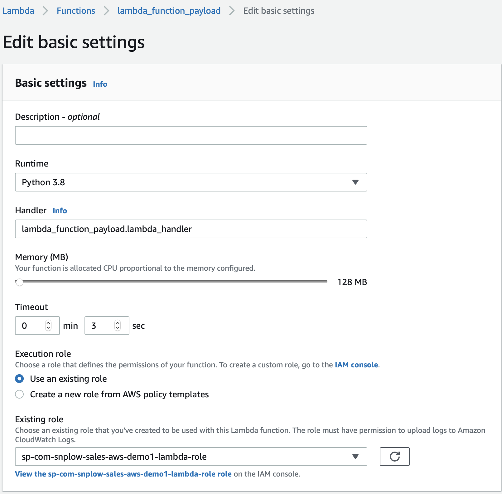
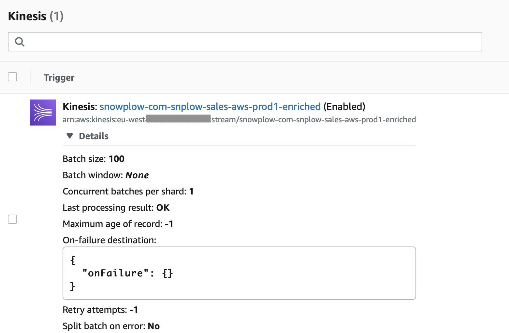
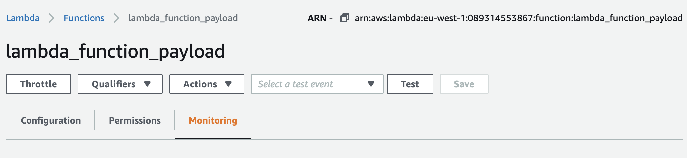
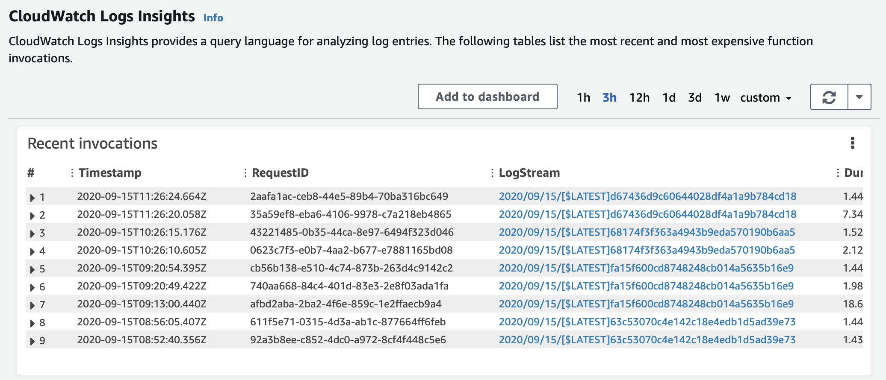
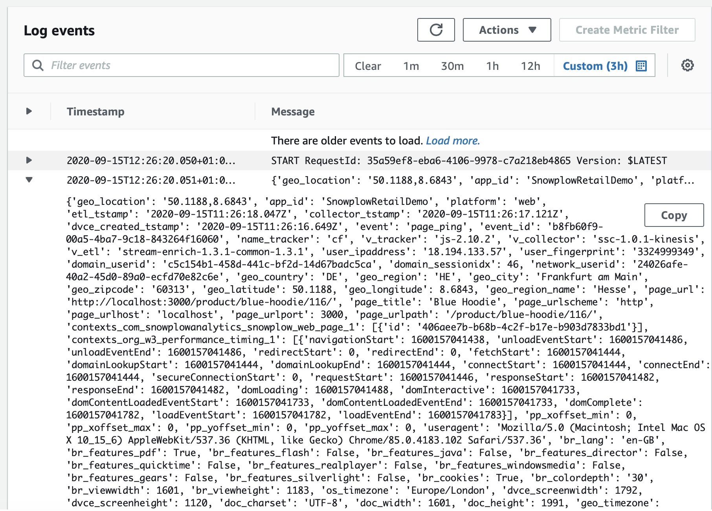

Taking action on event data in real time is a popular feature of Snowplow. We have customers using this to power use cases including:
*   __Retail:__ Fuel dynamic pricing, product and content recommendations to improve sales and revenue. 
*   __Customer support:__ Providing support staff with informaiton on where a user is stuck and what help articles they have recently viewed at the time they call the support line.
*   __Machine Learning:__ Feeding algorithms with data in real time for decision making
*   __Security:__ Fraud detection and anomaly detection 

First a quick recap of what is Snowplow. Snowplow provides a fully managed data pipeline in your own cloud account. It collects user's behavioural data from your products into a unified stream and passes iit into your data warehouse.

Once you have snowplow set up, it only takes a couple steps to start reading data from the real time stream. This guide will show you how to quickly achieve this in AWS using a Python Lambda function. It's important to note that this can also be [achieved on GCP](https://docs.snowplowanalytics.com/docs/setup-snowplow-on-gcp/) and with our [SDKs in other languages](https://github.com/snowplow/snowplow/wiki/Snowplow-Analytics-SDK#snowplow-analytics-sdks). 


# Tutorial
This is a really simple tutorial of reading from the real time stream. What we're going to do is set up a lambda function to trigger when data is written to the good enriched Kinesis events stream, transform the data into JSON with the Snowplow Python Analytics SDK and log the output to CloudWatch. Data that is written to the event stream has passed through the validation and enrichment steps in this diagram. 


## 1. Prerequisites
If you haven't got a snowplow pipeline set up in AWS using Kinesis streams this next part is not going to make much sense. If you're unsure [check out here to get started on open source](https://docs.snowplowanalytics.com/docs/setup-snowplow-on-aws/) or [here to contact us about our managed solution](http://snowplowanalytics.com/get-started/)

## 2. Set up IAM in AWS
For this tutorial your lambda function needs a role with permission to do the following: 
```
"kinesis:GetRecords",
"kinesis:GetShardIterator",
"kinesis:DescribeStream",
"kinesis:ListStreams",
"logs:CreateLogGroup",
"logs:CreateLogStream",
"logs:PutLogEvents"
```

## 3. Create the lambda function
Create a new Lambda function and give it the following properties: 
Name: lambda_function_payload
Runtime: Python 3
Permissions: Use existing role, and select the role you made in the previous step


## 4. Create the Python script
Copy this Python script to a file locally. In my case, it's called lambda_function_payload.py and is inside a subdirectory called lambda_function_payload. This subdirectory is important for the next step. 

```python
import snowplow_analytics_sdk.event_transformer
import snowplow_analytics_sdk.snowplow_event_transformation_exception
import json
import base64

# Decode batch of lambda records from Base64 to TSV
def decode_records(update):
    data = []
    if "Records" in update:
        for record in update["Records"]:
            if "kinesis" in record and "data" in record['kinesis']:
                decoded_data = base64.b64decode(record['kinesis']['data']).decode('utf-8')
                data.append(decoded_data)
    return data

# Entry point for the lambda function
def lambda_handler(event, context):
    # print("Received event: " + json.dumps(event, indent=2)) 

    # Decode received batch of records from Base64 to TSV
    records = decode_records(event)

    for record in records:
        try:
            # Transform record from TSV to JSON
            print(snowplow_analytics_sdk.event_transformer.transform(record))
            print("Succesfully retrieved and transformed event")
        except snowplow_analytics_sdk.snowplow_event_transformation_exception.SnowplowEventTransformationException as e:
            for error_message in e.error_messages:
                print(error_message)
            continue
        
    return
```

## 5. Package and upload the Python script
Package a zip file for lambda with the following script. Copy it to a new file and place it in the directory above the python script. Note that this is being run on a subdirectry with the Python app called lambda_function_payload.py. The Python fuction above is written in Python 3 the script below will install the [Snowplow Python Analytics SDK](https://github.com/snowplow/snowplow/wiki/Python-Analytics-SDK-Setup) in the directory so that it is included in the zip file.

```bash
#!/bin/bash
cd lambda_function_payload
pip3 install snowplow_analytics_sdk -t . --upgrade
chmod -R 755 .
zip -r ../lambda_function_payload.zip .
cd ..
```

Upload the zip file to lambda in the AWS Console. Since the dependency is a couple of mb, we won't be able to see and edit the code in AWS. 


Set up the basic settings to point to the handler in the Python script. The handler is the entry point into the code where execution will begin. The handler is formated as`name_of_python_file.name_of_handler_function`. The `.py` is not included.


## 6. Add a trigger to connect it to the enriched kinesis stream
Set up your trigger based on the screenshot below. The default values will be fine but note that your Kinesis stream will be named differently. 


## 7. Test and confirm events are being processed
Send some events into your Snowplow and give them a couple seconds to process. Click on monitoring on the lambda fuction page and scroll down to CloudWatch logs. You should see some entries appearing. 



Looking at the logs, you should see something like this. What you see here is the entire event's data in JSON format. You have now succesfully read from the real time stream and are ready to process your events!


# Okay, what next? 
Now that you have control over data coming out of the real time stream. Here are some articles with ideas on what you can do with it:
*   [How real-time data enables personalization and engagement](https://snowplowanalytics.com/blog/2019/09/27/how-real-time-data-lets-media-companies-personalize-content-messaging-and-advertising/)
*   [Snowplow for retail part 5](https://snowplowanalytics.com/blog/2019/03/06/snowplow-for-retail-part-5-what-can-we-do-with-data-when-were-well-established/)

If you want to learn more about what you can achieve wth Snowplow, [get in touch today!](https://snowplowanalytics.com/get-started/)